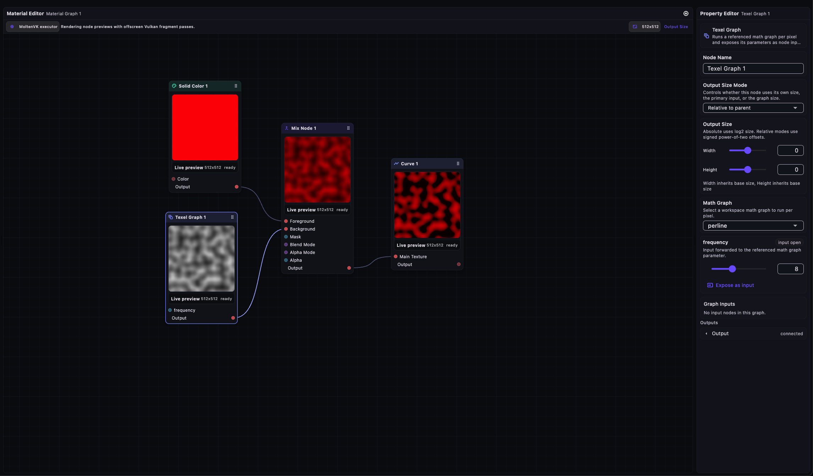
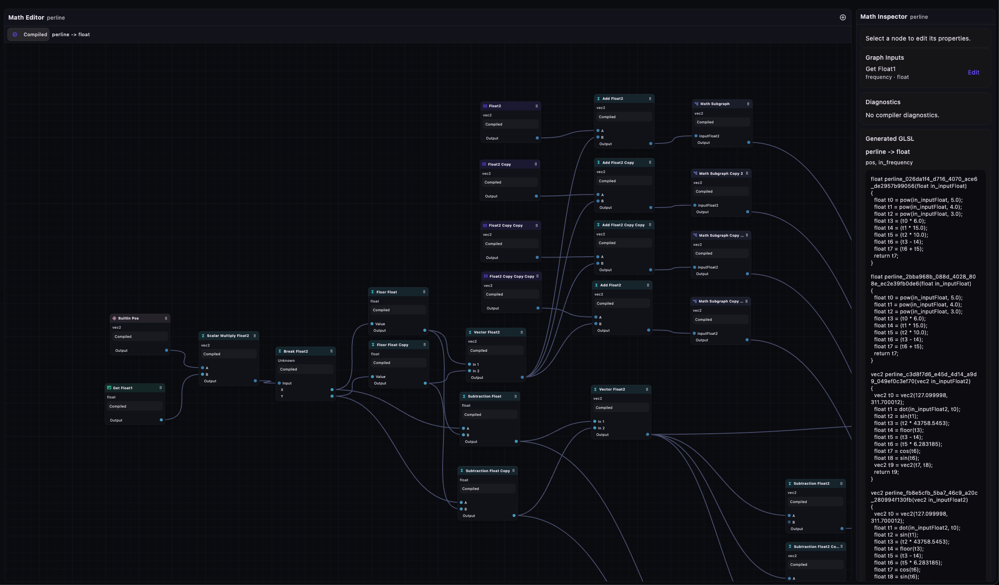

# afro

`afro` is a desktop-first material graph editor foundation built with Flutter.

## Screenshots

### Material Editor



### Math Editor



## Getting Started

Clone the repository and run the Flutter app:

```bash
flutter pub get
flutter run
```

For Flutter setup and platform-specific tooling, see the
[official Flutter documentation](https://docs.flutter.dev/).
